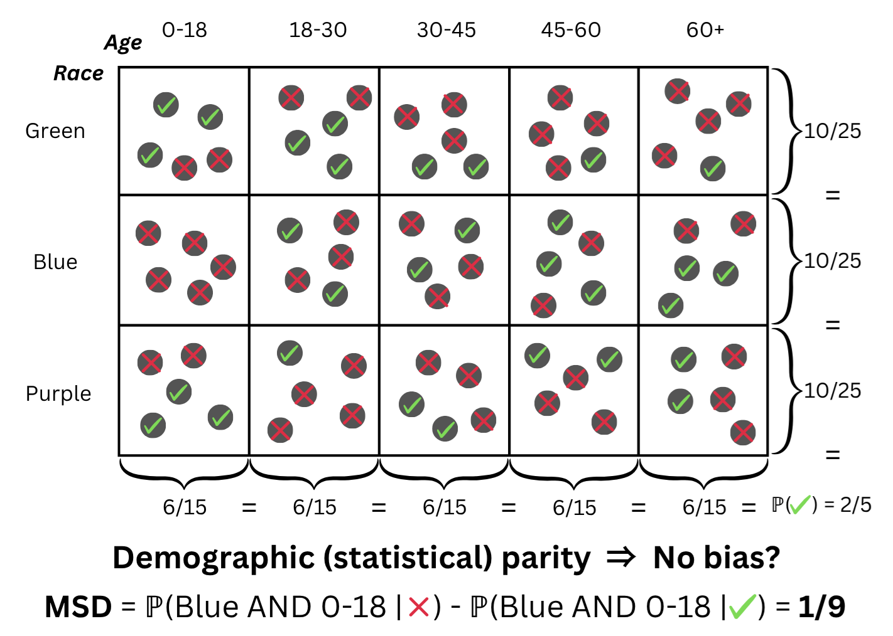

# humancompatible.detect

[](https://humancompatible-detect.readthedocs.io/en/latest)

humancompatible.detect is an open-source toolkit for detecting bias in AI models and their training data.

## AI Fairness

In a fairness auditing, one would generally like to know if two distributions are identical.
These distributions could be a distribution of internal private training data and publicly accessible data from a nation-wide census, i.e., a good baseline.
Or one can compare samples classified positively and negatively, to see if groups are represented equally in each class.

In other words, we ask

> Is there _some_ combination of protected attributes (race × age × …) for which people are treated noticeably differently?

Samples belonging to a given combination of protected attributes is called a subgroup.

<!-- Formally, let

* **X** ∈ ℝ<sup>d</sup> be the feature space,
* **P** and **Q** two distributions we want to compare (e.g. training vs census, positives vs negatives),
* **𝒫** ⊂ {1,…,d} the indices of *protected* features (age, sex, race, …).

A **sub-group** *S* is all samples whose protected attributes take one fixed value each.
We must consider every such intersection – their number is exponential in |𝒫|.
 -->

## Using HumanCompatible.Detect

1. Install the library:
   ```bash
   python -m pip install git+https://github.com/humancompatible/detect.git
   ```
2. Compute the bias ([MSD](#maximum-subgroup-discrepancy-msd) in this case):

   ```python
   from humancompatible.detect import detect_bias_csv

   # toy example
   # (col 1 = Race, col 2 = Age, col 3 = (binary) target)
   msd, rule_idx = detect_bias_csv(
       csv_path = csv,
       target = "Target",
       protected_list = ["Race", "Age"],
       method = "MSD",
   )
   ```

### More to explore

- `examples/01_usage.ipynb` – a 5-minute notebook reproducing the call above,
  then translating `rule_idx` back to human-readable conditions.

Feel free to start with the light notebook, then dive into the experiments with different datasets.

We also provide [documentation](https://humancompatible-detect.readthedocs.io/en/latest/detect.MSD.html). For more details on installation, see [Installation details](#installation-details).

---

## Methods

### Maximum Subgroup Discrepancy (MSD)

MSD is the subgroup maximal difference in probability mass of a given subgroup, comparing the mass given by each distribution.

<div align="center">
  
</div>

<!-- ```math

\text{MSD}(P,Q;\,𝒫)=
\max_{S\;\text{sub-group on }𝒫}\;
\bigl|\;P(S)-Q(S)\;\bigr|.

``` -->

- Naturally, two distributions are _fair_ iff all sub-groups have similar mass.
- The **arg max** immediately tells you _which_ group is most disadvantaged as an interpretable attribute-value combination.
- MSD has linear sample complexity, a stark contrast to exponential complexity of other distributional distances (Wasserstein, TV...)

---

## Installation details

### Requirements

Requirements are included in the `requirements.txt` file. They include:

- **Python ≥ 3.10**

- **A MILP solver** (to solve the mixed-integer program in the case of MSD)
  - The default solver is [HiGHS](https://highs.dev/). This is an open-source solver included in the requirements.
  - A faster, but proprietary solver [Gurobi](https://www.gurobi.com/) can also easily be used. Free academic licences are available. This solver was used in the original paper.
  - We use [Pyomo](https://pyomo.readthedocs.io/) for modelling. This allows for multiple solvers, see the lists of [solver interfaces](https://pyomo.readthedocs.io/en/stable/reference/topical/solvers/index.html) and [persistent solver interfaces](https://pyomo.readthedocs.io/en/stable/reference/topical/appsi/appsi.html). Note that the implementation sets the graceful time limit only for solvers Gurobi, Cplex, HiGHS, Xpress, and GLPK.

### (Optional) create a fresh environment

```bash
python -m venv .venv
# ── Activate it ─────────────────────────────────────────────
# Linux / macOS
source .venv/bin/activate
# Windows – cmd.exe
.venv\Scripts\activate.bat
# Windows – PowerShell
.venv\Scripts\Activate.ps1
```

### Install the package

> Before we complete the PyPI release you can install the latest snapshot straight from GitHub in one line:

```bash
python -m pip install git+https://github.com/humancompatible/detect.git
```

If you prefer an editable (developer) install:

```bash
git clone https://github.com/humancompatible/detect.git
cd detect
python -m pip install -r requirements.txt
python -m pip install -e .
```

### Verify it worked

```bash
python -c "from humancompatible.detect.MSD import compute_MSD; print('MSD imported OK')"
```

If the import fails you’ll see:

```bash
ModuleNotFoundError: No module named 'humancompatible'
```

## Why classical distances fail

| Distance                             | Needs to look at            | Worst-case samples | Drawback                                      |
| ------------------------------------ | --------------------------- | ------------------ | --------------------------------------------- |
| Wasserstein, Total Variation, MMD, … | full _d_-dimensional joint  | Ω(2<sup>d</sup>)   | exponential sample cost, no group explanation |
| **MSD (ours)**                       | only the protected marginal | **O(d)**           | exact group, human-readable                   |

MSD’s linear sample complexity is proven in the paper and achieved in practice via an **exact Mixed-Integer Optimisation** that scans the doubly-exponential search space implicitly, returning **both** the metric value and the rule that realises it.

---

## References

If you use the MSD in your work, please cite the following work:

```bibtex
@inproceedings{MSD,
  author = {N\v{e}me\v{c}ek, Ji\v{r}\'{\i} and Kozdoba, Mark and Kryvoviaz, Illia and Pevn\'{y}, Tom\'{a}\v{s} and Mare\v{c}ek, Jakub},
  title = {Bias Detection via Maximum Subgroup Discrepancy},
  year = {2025},
  isbn = {9798400714542},
  publisher = {Association for Computing Machinery},
  address = {New York, NY, USA},
  url = {https://doi.org/10.1145/3711896.3736857},
  doi = {10.1145/3711896.3736857},
  booktitle = {Proceedings of the 31st ACM SIGKDD Conference on Knowledge Discovery and Data Mining V.2},
  pages = {2174–2185},
  numpages = {12},
  location = {Toronto ON, Canada},
  series = {KDD '25}
}
```
